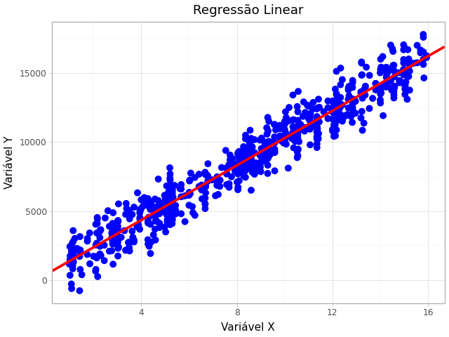

## Objetivo e Metodologia

A **Regressão Linear Simples** é um modelo estatístico fundamental utilizado para determinar a melhor reta de ajuste a um conjunto de dados, permitindo a predição de uma variável dependente ($Y$) com base em uma variável independente ($X$).

Neste projeto, o cálculo dos coeficientes de regressão ($\beta$, ou seja, a inclinação e o intercepto da reta) foi implementado de forma **manual** , utilizando a fórmula da **Equação Normal**: $$\beta = (X^T X)^{-1} X^T Y$$

### Ferramentas Utilizadas

| Biblioteca | Função no Projeto |
| :--- | :--- |
| **NumPy** | Essencial para todas as operações de **álgebra linear** (cálculo de transposta, inversa e multiplicação de matrizes). |
| **Pandas** | Utilizado para estruturar e organizar os dados de entrada e saída. |
| **Plotnine** | Utilizado para a **visualização** final do resultado, desenhando a reta calculada sobre os pontos de dados originais. |

### Resultado: Gráfico da Regressão Linear

